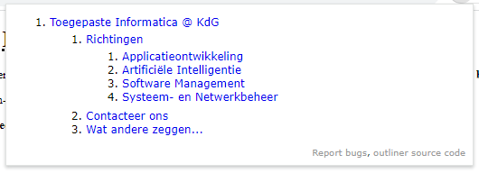
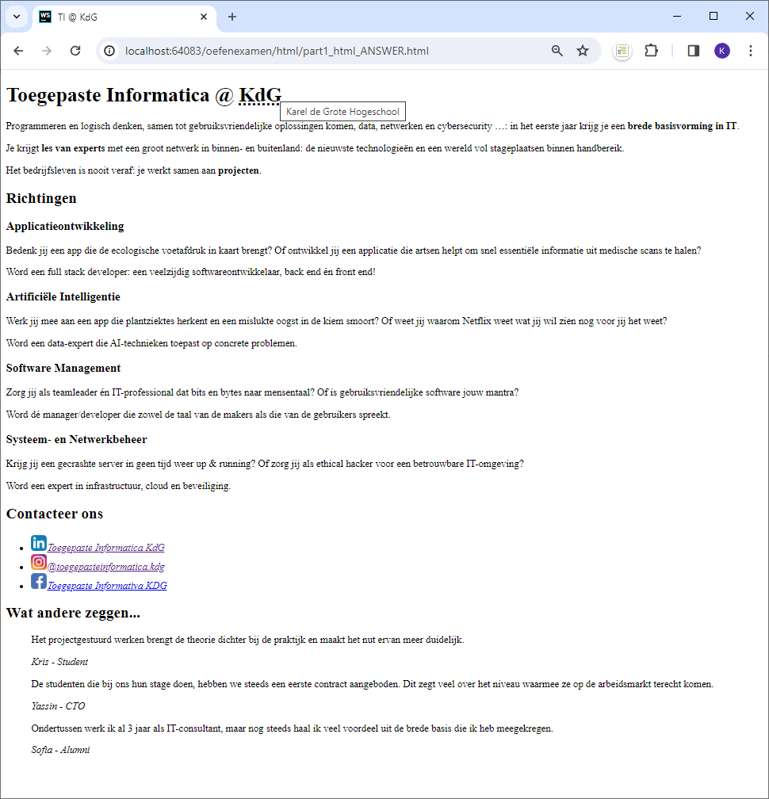
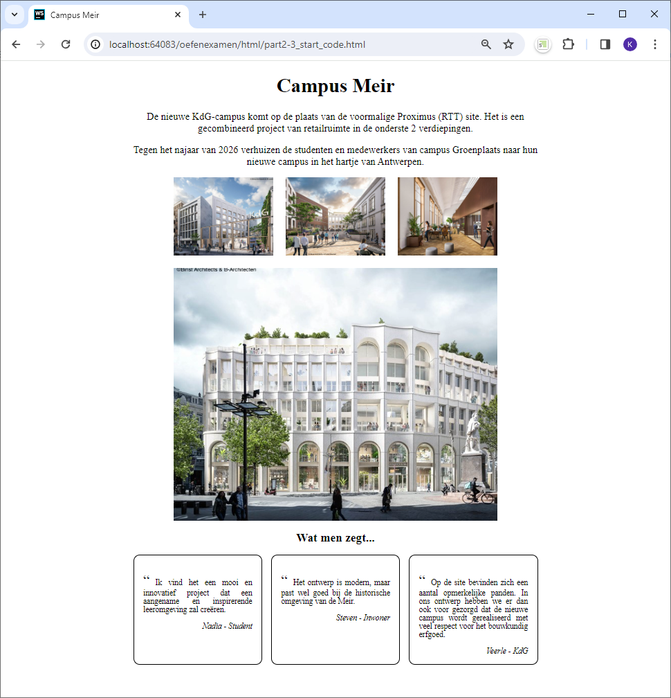
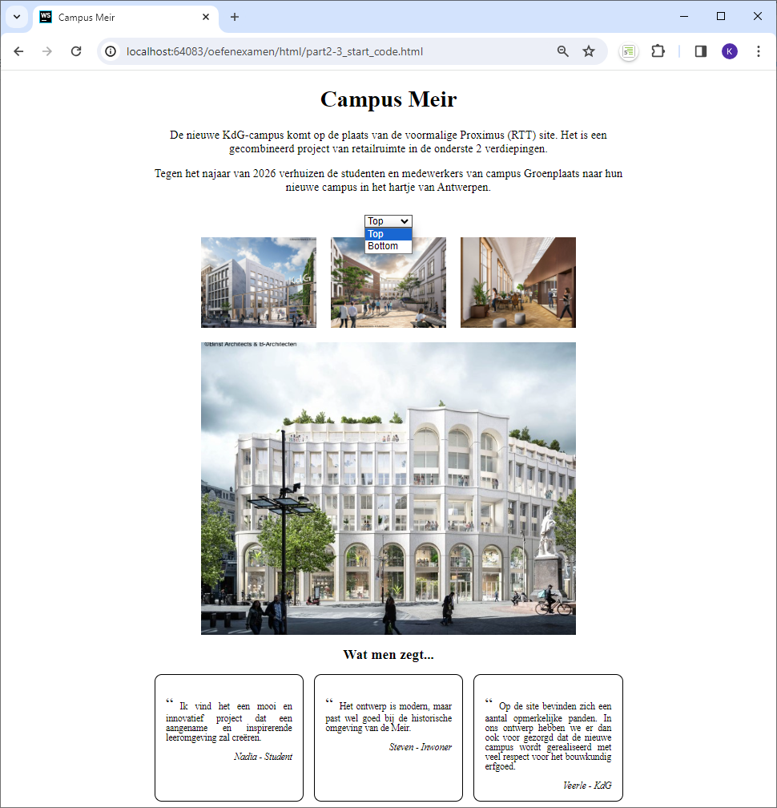
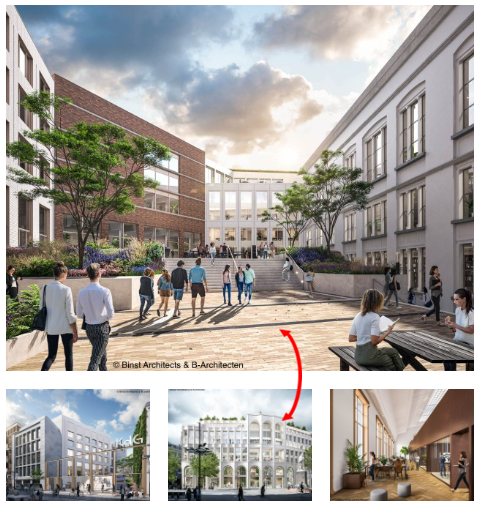

Examen User Interfaces 1
------

**Let op:** Voor elke vraag vragen we je code in een specifiek bestand te zetten,
deze bestanden zijn reeds aanwezig in dit project. Alle gewijzigde code buiten deze bestanden wordt **NIET** nagekeken.

Check voor al het opgeleverde werk je code met de lokale auto-validator,
zorg dat je overal OK in de bestandsnaam hebt staan (behalve de info bestanden).
Fouten aangegeven door de validator kosten je veel punten!

Zorg steeds voor leesbare code. Gebruik de automatische code formatering van WebStorm (menu ‘Code > Reformat Code’).

Veel succes!

Part 1 HTML
--
Voor deze vraag zet je al je code in **html/part1_html_ANSWER.html**

Alle info die je in het bestand moet steken zit in het bestand **html/part1_html_source.txt**
en de foto's vind je in de map 'media'.

- Zorg dat de document outline overeenkomt met:
  (= screenshot van het popupvenster van de Google Chrome plugin ‘HTML5 Outline’)  
  __Outline:__  
  

- De gebruikte afbeeldingen zitten in de `media` folder.
- Gebruik zeker volgende tags: `aside, nav, address, abbr, strong`.
    - **Let op**: andere tags kunnen nog steeds noodzakelijk zijn om het gewenste resultaat te bekomen
- De hyperlinks naar de sociale media mogen gewoon naar "#" verwijzen.

Zorg ervoor dat je het resultaat krijgt zoals op het screenshot (zie volgende pagina):

Part 2 CSS
--
Voor deze vraag zet je al je code in **css/part2_style_ANSWER.css**

De startcode in **html/part2-3_start_code.html** vormt je basis, je wijzigt deze HTML **niet**! Ook niet om classes/ids toe
te voegen.

Bekom het gewenste resultaat (zie screenshot) en houd hierbij rekening met:
- De gehele inhoud is horizontaal gecentreerd binnen een breedte van 650px.
- Je verbergt titels op een correcte manier. Deze titels zijn in html reeds voorzien van de css-klasse `.hiddenTitle`.
- Bij Foto's:
  - Gebruik een grid met 3 kolommen en 2 rijen.
  - Totale breedte benut 80% van de beschikbare ruimt en is ook gecentreerd.
  - Alle kolommen hebben dezelfde breedte.
  - Gebruik benoemde gebieden om de inhoud in het grid te plaatsen.
  - De afbeeldingen passen zich aan de beschikbare ruimte in het grid.
  - Er is een ruimte van 20px tussen kolommen en rijen.
- Bij 'Wat men zegt...':
  - Tekstgrootte is hier 0.8em.
  - Elk getuigenis heeft een breedte van 175px, en de overige lege ruimte is gelijk verdeeld.
  - Tussen inhoud en rand is er een ruimte van 15px.
  - Voor elke uitspraak voorzie je het karakter met unicode '\201C' (double quotes) met een lettergrootte van 1.8em.

Je komt tot volgend resultaat

Vraag 3 JS
-- 

Voor deze vraag zet je al je code in **script/part3_js_ANSWER.js**
De startcode in **html/part2-3_start_code.html** mag je niet wijzigen!

Zorg dat uitwerking voldoet aan volgende voorwaarden:

- Zorg ervoor dat je code werkt, en kwalitatief is.
- Gebruik enkel globale variabelen indien noodzakelijk.
- Voor elke listener dat je toevoegt, zet in de functie die je triggert als eerste lijn een console.log met de
  uitgevoerde gebeurtenis (bv. "change layout").

1) Wijzig layout
   - Maak keuzelijst die je voor de section 'images' invoegt.
   - Voorzie 2 keuzes 'Top' en 'Bottom' waarmee de layout van de afbeeldingen kan gewijzigd worden:
     - Keuze 'Top': de kleine afbeeldingen staan boven de grote afbeelding.
     - Keuze 'Bottom': de kleinde afbeeldingen staan onder de grote afbeelding.
   TIP: Als je een string wil met daarin dubbele quotes, zet je er enkele quote rond (bv. ' "x" "y" "z" ').

2) Toon afbeelding in het groot
   - Bij het klikken op een kleine afbeelding wordt deze afbeelding in het groot getoond.
   - De kleine en grote afbeeldingen wisselen van plaatst.
   TIP: Wijzig de bron (= 'src') van afbeeldingen

